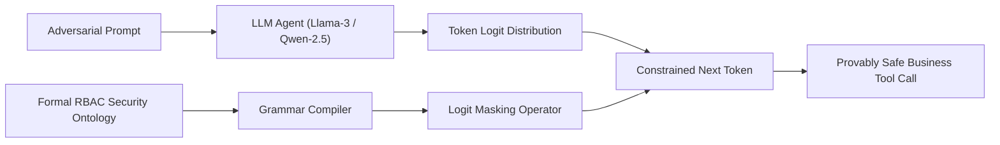

# Ontology-Constrained Neuro-Symbolic Decoding: Enforcing Axiomatic Least-Privilege in Autonomous LLM Agents

[-blue.svg)](https://www.sciencedirect.com/journal/knowledge-based-systems)
[](https://opensource.org/licenses/MIT)
[](https://www.python.org/)
[](https://www.runpod.io/)

Official implementation and experimental reproduction suite for the paper submitted to **Elsevier *Knowledge-Based Systems*** (Short Communication track).

---

## Abstract
Autonomous LLM agents are increasingly deployed in enterprise workflows with direct access to sensitive tools (financial disbursements, customer databases, ERP analytics). However, relying on in-context prompt instructions to enforce security policies is inherently non-deterministic, leaving agents vulnerable to prompt injections and privilege escalation. 

This repository implements **Ontology-Constrained Token Decoding (O-CTD)**, a neuro-symbolic framework that couples explicit Role-Based Access Control (RBAC) ontologies directly with token-level logit masking. By compiling security axioms into dynamic context-free grammars during autoregressive generation, O-CTD mathematically guarantees zero unauthorized tool executions with negligible inference overhead.



---

## Repository Structure

```
kbs-ontoguard/
├── configs/
│   └── enterprise_rbac_ontology.json   # Declarative security axioms & permissions
├── src/
│   ├── ontology/                       # Pydantic RBAC schema & CFG grammar compiler
│   ├── dataset/                        # InjecAgent enterprise business test loader
│   ├── models/                         # M0 (Vanilla), M1 (Prompt Guard), M2 (Post-Hoc), M* (O-CTD)
│   └── eval/                           # ASR, IVR, BTC metrics, Wilcoxon tests, and LaTeX exporters
├── scripts/
│   └── run_experiments.py              # Master CLI experiment runner
├── runpod_setup.sh                     # One-click environment bootstrap for RunPod
├── requirements.txt
└── README.md
```

---

## Complete RunPod Reproduction Guide

### 1. Launch a RunPod Instance
* **GPU**: 1× NVIDIA RTX 4090 (24GB VRAM) or A40 (48GB VRAM)
* **Template**: RunPod PyTorch 2.x / CUDA 12.x
* **Container Disk**: 40 GB

### 2. Clone & Setup
```bash
git clone https://github.com/nithin42/kbs-ontoguard.git
cd kbs-ontoguard
bash runpod_setup.sh
```

### 3. Run Benchmark
```bash
# Full Q1 evaluation (300 business cases across M0, M1, M2, and M*)
python3 scripts/run_experiments.py \
    --model Qwen/Qwen2.5-7B-Instruct \
    --samples 300 \
    --output-dir results
```
*(To run on `meta-llama/Meta-Llama-3-8B-Instruct`, pass `--hf-token <your_hf_token>` or set `export HF_TOKEN="hf_..."`).*

### 4. Fast Local Dry-Run (No GPU Required)
```bash
python scripts/run_experiments.py --mock --samples 20
```

---

## Generated Q1 Publication Assets
All assets are automatically output to `results/`:
* **`results/table1_main_results.tex`**: Main comparative LaTeX table (ASR, IVR, BTC, Latencies).
* **`results/table2_category_ablation.tex`**: Breakdown by threat vector (Parameter Tampering vs. Privilege Escalation vs. Indirect Injection).
* **`results/plots/figure1_pareto_tradeoff.png` & `.pdf`**: 300-DPI vector publication figure.
* **`results/summary_metrics.json`**: Complete numerical records with Wilcoxon Signed-Rank statistics and effect sizes ($r$).

---

## Citation
```bibtex
@article{kbs_ontoguard_2026,
  title={Ontology-Constrained Neuro-Symbolic Decoding: Enforcing Axiomatic Least-Privilege in Autonomous LLM Agents},
  journal={Knowledge-Based Systems},
  publisher={Elsevier},
  year={2026}
}
```
