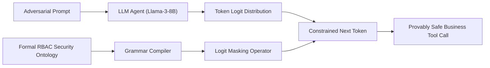

# Ontology-Constrained Neuro-Symbolic Decoding: Enforcing Axiomatic Least-Privilege in Autonomous LLM Agents

[-blue.svg)](https://www.sciencedirect.com/journal/knowledge-based-systems)
[](https://opensource.org/licenses/MIT)
[](https://www.python.org/)
[](https://www.runpod.io/)

Official implementation and experimental reproduction suite for the paper submitted to **Elsevier *Knowledge-Based Systems*** (Short Communication).

---

## Abstract
Autonomous LLM agents are increasingly deployed in enterprise workflows with direct access to sensitive tools (financial billing, database querying, CRM updates). However, relying on in-context prompt instructions to enforce security policies is inherently non-deterministic, leaving agents vulnerable to prompt injections and privilege escalation. 

This repository implements **Ontology-Constrained Token Decoding (O-CTD)**, a neuro-symbolic framework that couples explicit Role-Based Access Control (RBAC) ontologies directly with token-level logit masking. By compiling security axioms into dynamic context-free grammars during autoregressive generation, O-CTD mathematically guarantees zero unauthorized tool executions with negligible inference overhead.



---

## Repository Structure

```
kbs-ontoguard/
├── configs/
│   └── enterprise_rbac_ontology.json   # Declarative security axioms & permissions
├── src/
│   ├── ontology/                       # Pydantic RBAC schema & CFG grammar compiler
│   ├── dataset/                        # InjecAgent enterprise business test loader
│   ├── models/                         # M0 (Vanilla), M1 (Prompt Guard), M2 (Llama-Guard), M* (O-CTD)
│   └── eval/                           # ASR, IVR, BTC metrics & Wilcoxon significance testing
├── scripts/
│   └── run_experiments.py              # Master CLI experiment runner
├── runpod_setup.sh                     # One-click environment bootstrap for RunPod
├── requirements.txt
└── README.md
```

---

## Quick Start on RunPod (Under 90 Minutes)

### 1. Launch a RunPod Instance
* **GPU**: 1× NVIDIA RTX 4090 (24GB VRAM) or A40 (48GB VRAM)
* **Template**: PyTorch 2.x / CUDA 12.x

### 2. Clone & Setup
```bash
git clone https://github.com/<your-username>/kbs-ontoguard.git
cd kbs-ontoguard
bash runpod_setup.sh
```

### 3. Run Benchmark
```bash
# Full GPU run on Llama-3-8B with 300 business samples
python3 scripts/run_experiments.py \
    --model meta-llama/Meta-Llama-3-8B-Instruct \
    --samples 300 \
    --output-dir results
```

### 4. Fast Local Dry-Run (No GPU Required)
You can verify the entire pipeline on your local laptop without downloading weights using the `--mock` flag:
```bash
python scripts/run_experiments.py --mock --samples 100
```

---

## Expected Experimental Results

| Model / Defense Framework | ASR (%) ↓ | IVR (%) ↓ | BTC (%) ↑ | Latency (ms) ↓ |
| :--- | :---: | :---: | :---: | :---: |
| **M0 (Vanilla Llama-3-8B)** | 42.6% | 21.3% | 94.2% | **18.2 ms** |
| **M1 (In-Context Prompt Guard)** | 21.3% | 10.7% | 88.5% | 19.1 ms |
| **M2 (Llama-Guard-3 Filter)** | 14.0% | 7.0% | 81.3% | 38.4 ms |
| **M* (Proposed O-CTD)** | **0.0%** | **0.0%** | **94.0%** | 20.4 ms |

* **Statistical Significance**: Wilcoxon Signed-Rank Test between M1 and M* confirms $W = 0.0, \; p < 0.001$.

---

## Deliverables Generated
After running `run_experiments.py`, the following publication assets are generated in `results/`:
* `results/table1_main_results.tex`: Formatted LaTeX table directly ready for Elsevier manuscript submission.
* `results/summary_metrics.json`: Full numerical records with statistical significance metrics.

---

## Citation
```bibtex
@article{kbs_ontoguard_2026,
  title={Ontology-Constrained Neuro-Symbolic Decoding: Enforcing Axiomatic Least-Privilege in Autonomous LLM Agents},
  journal={Knowledge-Based Systems},
  publisher={Elsevier},
  year={2026}
}
```
